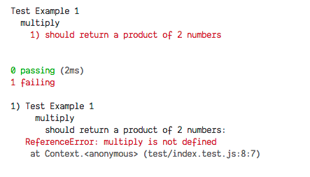
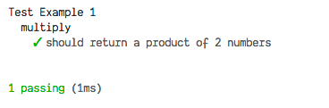
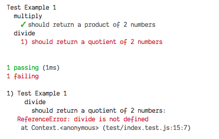
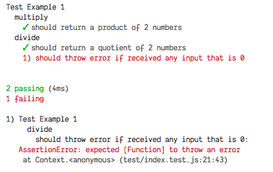
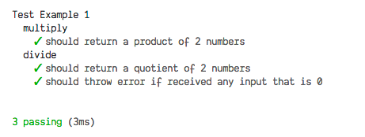

# Test Driven Development

## Situations

As developers we have encountered several nerve wrecking scenarios like the following:

- Refactored code and broke another function without knowledge
- Fixed a bug and another bug just magically appears
- Afraid to delete a set of unused code
- Wrote a set of function without knowing if it really works and hoping that it works

## Why should we do Test Driven Development

TDD is not just about testing, many developers fear the word "test" as it may sound tedious, time consuming. When the project is in a rush, developers tend to think that everything has to be done ASAP and writing tests would just slow them down. Although TDD may slow down things at start just as adopting any new skills, but as time goes, we as a developer would actually spend less time figuring out why things won't work.

### Benefits

TDD is a kind of technique that is learnt by developers to gain confidence in their code and not really just about the tests. Tests results are given as a useful side-effect, however the real benefit of Test Driven Development is that it promotes your thinking about code and boost your confidence in the knowledge that your code works

## What exactly is Test Driven Development

It is a technique for coding where you write test cases before you write any actual code.

It all boils down to a few simple steps:

1. Write new code if you have failing tests
2. Eliminate Duplicated Code (DRY)

Summarizing the above in a few rules

1. **Red** - Write test that would fail
2. **Green** - Do whatever to make the test work
3. **Refactor** - Eliminate all duplication, clean up all the mess while maintaining the test(s) in green.

## How to do Test Driven Development

In Javascript testing is done using the _Mocha.js_ framework as well as _Chai.js_ to write assertions in a more readable format

---

Create a folder and initialize node project

```bash
npm init

npm install --save-dev mocha chai
```

Under `package.json` file, update the "test" command to the following

```json
{
  "scripts": {
    "test": "mocha -w"
  }
}
```

> -w flag stands for watch, mocha will continue to monitor your file for changes and print out the test results to the terminal

---

Create a `tests` folder in the project root directory as well as a `index.test.js` file

```bash
mkdir tests/

cd tests/ && touch index.test.js
```

Open the `index.test.js` file

For example we are going to write an application to include 2 basic calucation functions

- Multiply
- Divide

---

First we have to import `Chai.js`, the assertion library and as well as the `functions` we are going to test (In this case, we have yet to write the functions but just import the modules, remember the 3 rules mentioned beforehand)

```javascript
const expect = require('chai').expect;
const { multiply, divide } = require('../app');
```

First we have to describe the test that we are going to do, treat this as some sort of a **label**

In `chai` describe is written using the `describe()` method which takes in 2 arguments, an **optional** string and a callback function

```javascript
describe('Test Example 1', function() {
  // Testing code here
});
```

`describe` callback functions are able to nest multiply `describe`(s) as different sub-test cases could belong to 1 test file

In this case we are going to add our first test case for our `multiply()` function.

Think of `describe()` as trying to explain what this function is, and `it()` is how this function should work.

```javascript
describe('Test Example 1', function() {
  describe('multiply', function() {
    it('should return a product of 2 numbers', function() {
      expect(multiply(5, 6)).to.equal(30);
    });
  });
});
```

Run `npm test` in the terminal and the result would be printed as



In testing, we must always provided multiple edge cases to test in prevention of bugs (maybe due to hard code or unit test cases that would render a function to work unintentionally)

```javascript
describe('multiply', function() {
  it('should return a product of 2 numbers', function() {
    expect(multiply(5, 6)).to.equal(30);
    expect(multiply(3, 6)).to.equal(18);
  });
});
```

Run `npm test` again, like wise it would fail as well because we have yet to create the `multiply` function


Create `app.js` file in the root directory and open it up, we will write the `multiply()` function in.

```javascript
function multiply(a, b) {
  return a * b;
}

module.exports = {
  multiply
};
```

Now you could actually run `npm test` again and your results would show something like this



We can now add on to our tests for our `divide` function.

```javascript
describe('divide', function() {
  it('should return a quotient of 2 numbers', function() {
    expect(divide(6, 3)).to.equal(2);
    expect(divide(10, 2)).to.equal(5);
  });
});
```

`npm test` results



---

Back to the `app.js` file, we have to code our division function

```javascript
function divide(a, b) {
  return a / b;
}

module.exports = {
  divide
};
```

---

However our test did not catch exceptions like dividing numbers with 0, which is impossible mathematically.

In events like this, we are encouraged to think in the process of writing test cases. What are the obvious exceptions that we should be handling.

```javascript
describe('divide', function() {
  it('should return a quotient of 2 numbers', function() {
    expect(divide(6, 3)).to.equal(2);
    expect(divide(10, 2)).to.equal(5);
  });

  /**
   * a inline executing function is expected here
   * so chai would not try to execute
   * the divide function immediately
   * and throw an error instead
   * */
  it('should throw error if received any input that is 0', function() {
    expect(() => divide(10, 0)).to.throw();
    expect(() => divide(0, 57)).to.throw();
  });
});
```

Results:



---

So the cycle repeats itself again.

1. Write failing tests
2. Make test pass
3. Refactor if needed

```javascript
function divide(a, b) {
  if (a === 0 || b === 0) {
    throw new Error('Input not be zero');
  }

  return a / b;
}

module.exports = {
  divide
};
```

Results:



---

For one last change we are going to do to the test file is to ensure we can still do division with numbers lesser than 0

```javascript
describe('divide', function() {
  it('should return a quotient of 2 numbers', function() {
    expect(divide(6, 3)).to.equal(2);
    expect(divide(10, 2)).to.equal(5);
    expect(divide(10, -2)).to.equal(-5);
  });

  it('should throw error if received any input that is 0', function() {
    expect(() => divide(10, 0)).to.throw();
    expect(() => divide(0, 57)).to.throw();
  });
});
```

Results:


## And we can be all happy writing code without worrying about breaking anything! 😄
